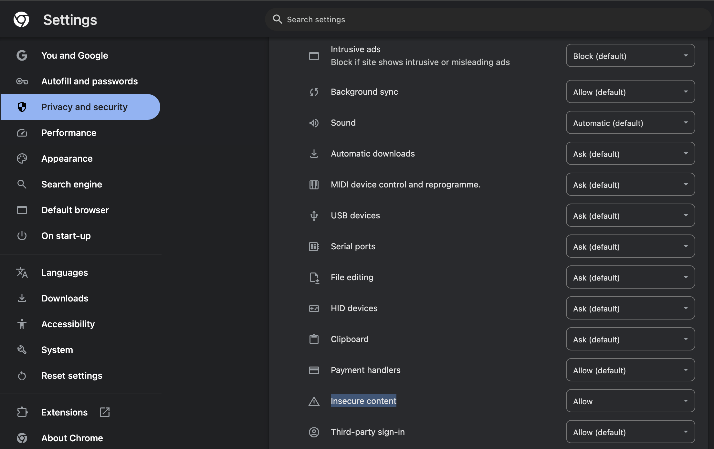

# Video Fetcher API - Fampay Intern Assignment


API to fetch latest videos sorted in reverse chronological order of their publishing date-time from YouTube for a given tag/search query in a paginated response.

## Implemented Features:

- Server calls the YouTube API continuously in background (async) with some interval (say 10 seconds) for fetching the latest videos for a predefined search query("news") and stores the data of videos (specifically these fields - Video title, description, publishing datetime, thumbnails URLs and any other fields you require) in postgres database with proper indexes
(Indexing on video_id and published_at).

- A GET API which returns the stored video data in a paginated response sorted in descending order of published datetime.
- Dockerized and Deployed on AWS. used RDS postgres for scalability. http://3.108.83.52:3000/

- Added support for supplying multiple API keys so that if quota is exhausted on one, it automatically uses the next available key. User can send a new key using the API endpoint
- Made a dashboard to view the stored videos with filters and sorting options. 
link to dashboard ( reached free tier limit dashboard will be up soon )
please note that front-end will only work if the insecure-content is allowed in your browser Privacy and Security settings



This API provides endpoints to fetch YouTube video data and manage API keys. It includes:

1. `/videos` - Fetches a paginated list of YouTube videos.
2. `/videos/key` - Allows adding a new API key for video fetching.

## Base URL

```
http://3.108.83.52:3000/
```

## Local Setup


This guide will help you set up the Fampay Video Fetcher locally on your machine.

## Prerequisites

Before you begin, ensure you have the following installed:

- Go (version 1.16 or later)

## Cloning the Repository

To get started, clone the repository to your local machine. Open your terminal and run:

```bash
git clone https://github.com/RajendraKumarVesapogu/fampay-assignment.git
```


## Navigating to the Project Directory

Change into the project directory:

```bash
cd fampay-assignment
```
## Setting up the Database

Create a table the schema provided in the videos_schema.sql file. Please note that the table name should be videos.

## Setting Up Environment Variables

The application requires specific environment variables to run. Create a `.env` file in the project root and set the required variables. Below is an example of what to include:

```bash
# .env
DB_HOST=your_database_host            # e.g., localhost
DB_PORT=your_database_port            # e.g., 5432
DB_USER=your_database_user            # e.g., postgres
DB_PASSWORD=your_database_password    # e.g., password
DB_NAME=your_database_name            # e.g., fampay_db
PORT=3000                           # Port on which the server will run
YOUTUBE_API_KEY1=<your_youtube_api_key>
YOUTUBE_API_KEY2=<your_youtube_api_key>
YOUTUBE_API_KEY3=<your_youtube_api_key>
```

Make sure to replace `<your_youtube_api_key>` with your actual YouTube API key.

## Installing Dependencies

Before running the application, you need to install the necessary Go dependencies. Run the following command:

```bash
go mod tidy
```

## Running the Application Locally

To run the application locally, use the following command:

```bash
go run main.go
```

## Accessing the API

Once the application is running, you can access the API at:

```
http://localhost:3000/
```

### Example API Calls

- **Fetch Videos:**
  ```
  GET http://localhost:3000/videos?sort_order=desc&pagination_size=10&pagination_page=1
  ```

- **Add API Key:**
  ```
  POST http://localhost:3000/videos/key
  {
    "api_key": "YOUR_NEW_API_KEY"
  }
  ```


## Endpoints

### 1. GET `/videos`

Fetches a list of YouTube videos based on query parameters, including pagination and optional filters.

#### Query Parameters

| Parameter         | Type   | Required | Description                                                                                     |
|-------------------|--------|----------|-------------------------------------------------------------------------------------------------|
| `sort_order`      | string | Yes      | Specifies the sorting order for videos (e.g., `asc` or `desc`).                                |
| `pagination_size` | int    | Yes      | The number of videos to retrieve per page.                                                     |
| `pagination_page` | int    | Yes      | The page number to retrieve.                                                                   |
| `published_after` | string | No       | The date filter for videos published after this date (RFC 3339 format eg. 2006-01-02T15:04:05Z). Defaults to today’s date. |

#### Sample Request

```http
GET http://localhost:3000/videos?sort_order=desc&pagination_size=10&pagination_page=1&published_after=2024-11-01
```

#### Response

The response contains the list of videos matching the query parameters.

##### Successful Response

```json
{
  "error": false,
  "response": {
    "videos": [
      {
        "VideoID": "1l_w5g7fbjA",
        "Title": "LIVE | Punjab Latest News 24x7 | Air pollution | Bhagwant Mann | Anmol Bishnoi | PM Modi | News18",
        "Description": "ਤੁਹਾਡੇ ਸ਼ਹਿਰ, ਇਲਾਕੇ ਤੇ ਪਿੰਡ ਦੀ ਹਰ ਖ਼ਬਰ 'ਤੇ ਨਜ਼ਰ। ਦੇਖੋ, ਸਿਰਫ਼ News18 Punjab ...",
        "PublishedAt": "2024-11-02T09:13:49Z",
        "ThumbnailURL": "https://i.ytimg.com/vi/1l_w5g7fbjA/default.jpg",
        "ChannelTitle": "News18 Punjab",
        "ChannelID": "UC-crZTQNRzZgzyighTKF0nQ"
      },
      {
        "VideoID": "aGin5L80RII",
        "Title": "দুপুরের সময় | দুপুর ২টা | ২ নভেম্বর ২০২৪ | Somoy TV Bulletin 2pm| Latest Bangladeshi News",
        "Description": "bdpolitics #bnp #topnews #uselection #somoytvbulletin দুপুরের সময় | দুপুর ২টা | ২ নভেম্বর ...",
        "PublishedAt": "2024-11-02T09:11:17Z",
        "ThumbnailURL": "https://i.ytimg.com/vi/aGin5L80RII/default.jpg",
        "ChannelTitle": "SOMOY TV Bulletin",
        "ChannelID": "UCNUFterLJ9vpFZZ0try7sLA"
      }
    ]
  }
}
```

##### Error Response

```json
{
  "error": true,
  "message": "pagination_size: must be no greater than 10."
}
```

---

### 2. POST `/videos/key`

Adds a new API key to be used for fetching videos.

#### Request Body

| Parameter | Type   | Required | Description                        |
|-----------|--------|----------|------------------------------------|
| `api_key` | string | Yes      | The API key to add to the service. |

##### Sample Request

```json
{
  "api_key": "xxxxxxxxxxxxxxxxxx"
}
```

#### Response

Indicates if the key was successfully added.

##### Successful Response

```json
{
  "error": false,
  "response": {
    "success": true
  }
}
```

##### Error Response

```json
{
  "error": true,
  "message": "Invalid API key format"
}
```


## Notes

- Ensure that the `api_key` provided in `/videos/key` endpoint is valid, as it will be used for subsequent API calls.
- Dates for the `published_after` parameter must be in RFC-3339 format (e.g., `2006-01-02T15:04:05Z`).

---

## Example Usage

1. **Fetch Videos Sorted by Date (Newest First):**

   ```http
   GET /videos?sort_order=desc&pagination_size=5&pagination_page=1
   ```
   ```cURL
   curl 'http://localhost:3000/videos?sort_order=desc&pagination_size=10&pagination_page=1&published_after=2024-11-14T17%3A59%3A00Z' \
   -H 'Accept: application/json' \
   -H 'Accept-Language: en-US,en;q=0.9,en-IN;q=0.8' \
   -H 'Connection: keep-alive' \
   -H 'Origin: https://main.d2unwkiq4klrzx.amplifyapp.com' \
   -H 'User-Agent: Mozilla/5.0 (Windows NT 10.0; Win64; x64) AppleWebKit/537.36 (KHTML, like Gecko) Chrome/130.0.0.0 Safari/537.36 Edg/130.0.0.0'
   ```

   

2. **Add a New API Key:**

   ```http
   POST /videos/key
   Content-Type: application/json

   {
     "api_key": "YOUR_NEW_API_KEY"
   }
   ```
  ```cURL
curl 'http://localhost:3000/videos/key' \
  -H 'Accept: application/json' \
  -H 'Accept-Language: en-US,en;q=0.9,en-IN;q=0.8' \
  -H 'Connection: keep-alive' \
  -H 'Content-Type: application/json' \
  -H 'Origin: https://main.d2unwkiq4klrzx.amplifyapp.com' \
  -H 'User-Agent: Mozilla/5.0 (Windows NT 10.0; Win64; x64) AppleWebKit/537.36 (KHTML, like Gecko) Chrome/130.0.0.0 Safari/537.36 Edg/130.0.0.0' \
  --data-raw '{"api_key":"test-key"}' \
  --insecure
  ```
